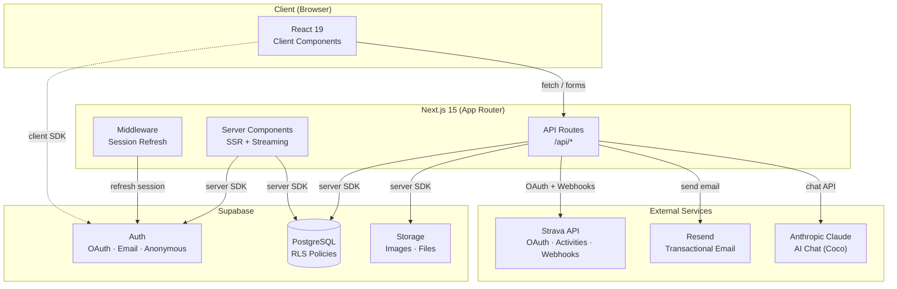
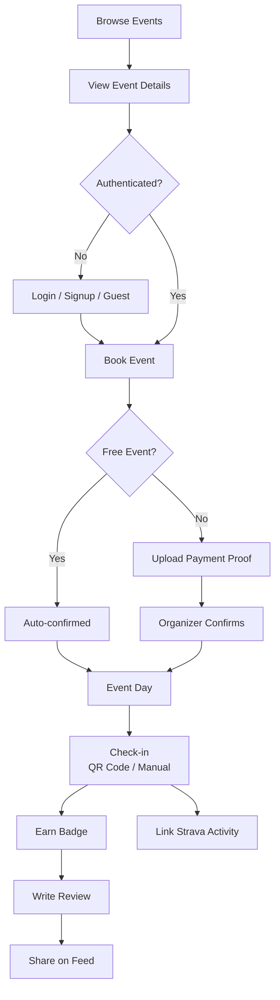
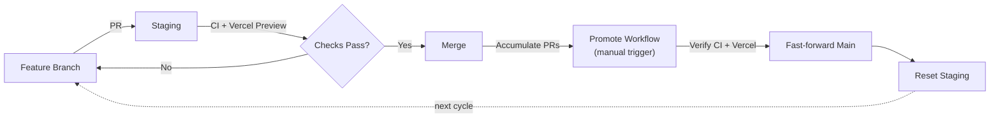

# EventTara

Adventure event booking platform for the Philippines. Browse, book, and manage outdoor events — hiking, mountain biking, road biking, running, and trail running.

**Tara na!** _(Let's go!)_

## Tech Stack

- **Framework:** Next.js 15 (App Router) + React 19
- **Database & Auth:** Supabase
- **CMS:** Supabase-based CMS
- **Styling:** Tailwind CSS
- **Email:** Resend
- **AI:** Anthropic Claude SDK (chat assistant "Coco")
- **Testing:** Vitest (unit) + Playwright (E2E)
- **Activity Tracking:** Strava integration

## Architecture

### System Overview



### User Journey



### Branch & Deploy Workflow



## Getting Started

### Prerequisites

- Node.js 20+
- [pnpm](https://pnpm.io/installation) (strictly enforced — npm/yarn will not work)
- A [Supabase](https://supabase.com) project

### 1. Install dependencies

```bash
pnpm install
```

### 2. Set up environment variables

```bash
cp .env.local.example .env.local
```

Fill in your keys:

| Variable                        | Required | Where to get it                                                                     |
| ------------------------------- | -------- | ----------------------------------------------------------------------------------- |
| `NEXT_PUBLIC_SUPABASE_URL`      | Yes      | Supabase Dashboard > Settings > API                                                 |
| `NEXT_PUBLIC_SUPABASE_ANON_KEY` | Yes      | Supabase Dashboard > Settings > API                                                 |
| `RESEND_API_KEY`                | No       | [resend.com](https://resend.com) — emails are skipped if absent                     |
| `ANTHROPIC_API_KEY`             | No       | [console.anthropic.com](https://console.anthropic.com) — for AI chat assistant      |
| `SUPABASE_SERVICE_ROLE_KEY`     | No       | Supabase Dashboard > Settings > API — only for seed scripts                         |
| `STRAVA_CLIENT_ID`              | No       | [strava.com/settings/api](https://www.strava.com/settings/api) — Strava integration |
| `STRAVA_CLIENT_SECRET`          | No       | Strava API settings                                                                 |

### 3. Run the dev server

```bash
pnpm dev
```

Open [http://localhost:3001](http://localhost:3001).

### 4. Seed the database (optional)

Populate the database with test accounts, events, guides, badges, and bookings:

```bash
pnpm seed
```

To remove seeded data:

```bash
pnpm unseed
```

> Both require `SUPABASE_SERVICE_ROLE_KEY` in `.env.local`.

## Scripts

| Command             | Description                          |
| ------------------- | ------------------------------------ |
| `pnpm dev`          | Start development server (port 3001) |
| `pnpm build`        | Production build                     |
| `pnpm start`        | Start production server              |
| `pnpm lint`         | Run ESLint                           |
| `pnpm typecheck`    | TypeScript type checking             |
| `pnpm format`       | Format all files with Prettier       |
| `pnpm format:check` | Check formatting (used in CI)        |
| `pnpm seed`         | Seed database with test data         |
| `pnpm unseed`       | Remove seeded data                   |
| `pnpm seed:cms`     | Seed Payload CMS with sample pages   |
| `pnpm test`         | Run Vitest unit tests                |
| `pnpm test:e2e`     | Run Playwright E2E tests             |

## Project Structure

```
src/
├── app/
│   ├── (frontend)/
│   │   ├── (auth)/          # Login, signup, guest setup
│   │   ├── (participant)/   # Events, bookings, profiles, guides, about
│   │   ├── (organizer)/     # Dashboard, event/guide management, check-ins
│   │   └── api/             # API routes
│   └── page.tsx             # Landing page
├── components/
│   ├── about/               # About page journey gallery
│   ├── badges/              # Badge cards and grids
│   ├── booking/             # Booking flow, auth modal, confirmation
│   ├── chat/                # AI chat assistant (Coco) bubble and panel
│   ├── dashboard/           # Organizer dashboard components
│   ├── events/              # Event cards, gallery, filters
│   ├── guides/              # Guide cards
│   ├── landing/             # Hero, entry banner, waitlist modal
│   ├── layout/              # Navbar, footer, mobile nav, splash screen
│   ├── maps/                # Map picker, event location map
│   ├── participant/         # Upcoming/past bookings
│   ├── reviews/             # Review form, review list, star rating
│   └── ui/                  # Shared UI primitives (date picker, inputs, badges)
├── lib/
│   ├── ai/                  # AI search prompt for chat
│   ├── constants/           # Preset avatars, Philippine provinces
│   ├── email/               # Email sending + templates
│   ├── strava/              # Strava client, constants, types
│   ├── store/               # Redux Toolkit store
│   ├── supabase/            # Client, server, and types
│   ├── utils/               # Date formatting, geo, helpers
│   └── utils.ts             # cn() helper
├── middleware.ts             # Session refresh
e2e/                          # Playwright E2E tests
vitest.config.mts             # Vitest unit test config
```

## User Roles

| Role            | Description                                                                        |
| --------------- | ---------------------------------------------------------------------------------- |
| **Participant** | Browse events, book spots, earn badges, review events and guides                   |
| **Organizer**   | Create events, manage guides, manage bookings, check in participants, award badges |
| **Guest**       | Anonymous browsing via Supabase anonymous auth                                     |

Creating your first event automatically upgrades your account to organizer.

## Key Features

### Events

Browse, filter, and book outdoor adventure events with infinite scroll and pagination. Events support single-day and multi-day scheduling with a visual date range picker, cover photos, map pins, badges, and reviews. Free events skip the payment step and auto-confirm participants.

### Guides (Hiking)

Organizers manage hiking guide profiles on behalf of local guides. Guides appear on hiking event detail pages and have public profile pages at `/guides/[id]` with bio, contact, ratings, events, and reviews. Participants can review guides after completing events.

### Badges

Organizers create badges for events. Participants earn badges after check-in, viewable on their profile.

### Dashboard

Organizers manage events, bookings, check-ins, and payments from `/dashboard`. Organizers are redirected to the dashboard automatically on login. Event publishing shows real-time loading feedback.

### AI Chat Assistant (Coco)

A floating chat bubble ("Ask Coco!") powered by Anthropic Claude that helps users find events, get recommendations, and answer questions about the platform. Accessible from every page.

### Strava Integration

Full Strava integration for activity tracking, verification, and route sharing. OAuth login, account linking, activity verification (manual + webhook auto-matching), profile stats, and route maps (Leaflet).

### Social Feed

Activity feed with comments, @mentions, likes, and notifications. Feed showcase section on the landing page.

### About Page

Origin story page at `/about` with an interactive journey timeline, image lightbox gallery, breadcrumbs, and share buttons.

## Testing

- **Unit tests** (Vitest): 43+ tests across utility modules (`src/lib/**/__tests__/`). Run with `pnpm test`.
- **E2E tests** (Playwright): Auth, events, navigation specs in `e2e/`. Run with `pnpm test:e2e`.
- **CI pipeline**: Unit tests run on every PR. E2E tests run only on merge to main.

## API Routes

| Endpoint                      | Method             | Description                         |
| ----------------------------- | ------------------ | ----------------------------------- |
| `/api/events`                 | GET, POST          | List/create events                  |
| `/api/events/[id]`            | GET, PATCH, DELETE | Manage event                        |
| `/api/events/[id]/guides`     | GET, POST, DELETE  | Event-guide linking                 |
| `/api/events/[id]/route-data` | GET, POST, DELETE  | Event route management              |
| `/api/guides`                 | GET                | List guides                         |
| `/api/guides/[id]`            | GET                | Guide details with events & reviews |
| `/api/guides/[id]/reviews`    | GET, POST          | Guide reviews                       |
| `/api/bookings`               | POST               | Book an event                       |
| `/api/checkins`               | POST               | Check in participant (QR or manual) |
| `/api/badges`                 | GET, POST          | List or create badges               |
| `/api/badges/award`           | POST               | Award badge to participants         |
| `/api/chat`                   | POST               | AI chat assistant (Coco)            |
| `/api/feed`                   | GET                | Activity feed                       |
| `/api/waitlist`               | GET, POST          | Organizer waitlist                  |
| `/api/strava/status`          | GET                | Check Strava connection             |
| `/api/strava/activities`      | GET                | Fetch Strava activities             |
| `/api/strava/activities/link` | POST               | Link activity to booking            |
| `/api/webhooks/strava`        | GET, POST          | Strava webhook                      |

## License

Private project.
